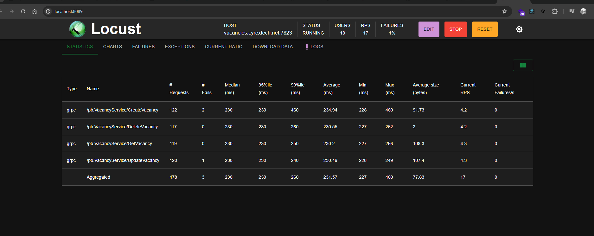

### README

# Locust Load Testing for Vacancy Service

## Overview

This project contains a Locust load testing script designed to interact with a gRPC-based vacancy service. The script performs the following tasks:

1. Logs in users using pre-defined credentials.
2. Periodically creates, updates, fetches, and deletes vacancies.
3. Periodically fetches a list of all vacancies available on the server.

## Project Structure

```
.
├── services/
│   ├── auth_service_pb2_grpc.py
│   ├── auth_service_pb2.py
│   ├── rpc_create_vacancy_pb2_grpc.py
│   ├── rpc_create_vacancy_pb2.py
│   ├── rpc_signin_user_pb2_grpc.py
│   ├── rpc_signin_user_pb2.py
│   ├── rpc_update_vacancy_pb2_grpc.py
│   ├── rpc_update_vacancy_pb2.py
│   ├── vacancy_service_pb2_grpc.py
│   ├── vacancy_service_pb2.py
│   ├── vacancy_pb2_grpc.py
│   └── vacancy_pb2.py
├── utils/
│   ├── __init__.py
│   ├── grpcUser.py
│   └── users.py
├── .gitignore
├── main.py
|── locust.log
├── locustfile.py
├── requirements.txt
└── README.md
```

## Prerequisites

- Python 3.11 or higher

## Installation

1. Clone the repository:
   ```bash
   git clone https://github.com/iaggocapitanio1/magicMediaRPC
   cd magicMediaRPC
   ```

2. Create a virtual environment and activate it:
   ```bash
   python -m venv .venv
   .venv\Scripts\activate  # On Windows
   source .venv/bin/activate  # On macOS/Linux
   ```

3. Install the dependencies:
   ```bash
   python -m pip install -r requirements.txt
   ```

## Usage

### Running Locust

1. Ensure you have all necessary dependencies installed:
   ```bash
   pip install grpcio grpcio-tools locust
   ```

2. Start Locust:
   ```bash
   locust -f locustfile.py
   ```

3. Open your browser and navigate to `http://localhost:8089` to access the Locust web interface.

4. Configure the number of users to simulate and the spawn rate, then start the test.

### Locust File (`locustfile.py`)

The `locustfile.py` script performs the following actions:

1. Logs in using pre-defined user credentials.
2. Periodically creates a vacancy with pseudo-random data.
3. Updates the vacancy.
4. Fetches the vacancy details.
5. Deletes the vacancy.
6. Fetches a list of all vacancies every 45 seconds.

### Example User Data (`utils/users.py`)

The `users.py` file defines a `User` class used to handle user credentials and operations. Its has methods
to sing in, verify the email, and sing up.

### Proto Files and gRPC Services (`services/`)

The `services` directory contains the generated gRPC service stubs and message classes.

## Implementation Details

- **gRPC Connection**: The script establishes a gRPC connection to `vacancies.cyrextech.net:7823`.
- **User Management**: Pre-defined user credentials are stored and used to authenticate with the service.
- **Task Execution**: Tasks are defined in the `VacancyUser` class and executed at specified intervals.

### Creating and Managing Vacancies

- **Create Vacancy**: Uses the `CreateVacancyRequest` message to create a new vacancy.
- **Update Vacancy**: Uses the `UpdateVacancyRequest` message to update an existing vacancy.
- **Fetch Vacancy**: Uses the `GetVacancyRequest` message to fetch vacancy details.
- **Delete Vacancy**: Uses the `VacancyRequest` message to delete a vacancy.
- **Fetch All Vacancies**: Uses the `GetVacanciesRequest` message to fetch all vacancies.

### Error Handling

The script includes basic error handling for common scenarios, such as missing credentials or incorrect file formats.

## Notes

- Ensure the proto files are up-to-date and correctly reflect the service definitions.
- Adjust the task intervals and user credentials as needed for your testing scenarios.


## Author
    Iaggo Capitanio
### Education
  - Universidade Tecnológica Federal do Paraná (Brazil) 
  - Instituto  Politécnico de Bragança (Portugal)
### Useful Links
- [Iago Capitanio](https://github.com/iaggocapitanio1)
- [LinkedIn](https://www.linkedin.com/in/iaggo-capitanio/)
